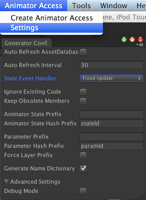

# Animator Access Generator Advanced Topics

See the basic [README.md](../README.md) for an introduction to Animator Access Generator

## Settings
Configuration is done via the Settings window. 

1. **Auto Refresh AssetDatabase:** Automatically call an AssetDabase.Refresh () after updating an existing AnimatorAccess class.  
   Note that the MonoDevelop project is reloaded too which can be annoying.
1. **Auto Refresh Interval:** Automatically check for updates after this interval (in seconds) has elapsed. Set this to 0 to suppress automatic checking.
1. **Ignore Existing Code:** Unchecked (default) means that the current version of the class is analysed first. Existing members that are not valid any longer are created once but with the obsolete attribute set.  
   So you can replace references to these outdated members in your code. Performing another generation will then remove all obsolete members.  Check this if existing members should be removed immediately.  
   Note that this option overwrites 'Keep Obsolete Members'
1. **Keep Obsolete Members:** Obsolete fields and methods are not removed. This might lead to a lot of unnecessary code.  
   Note that this option is not considered if 'Ignore Existing Code' is set.
1. **Force Layer Prefix:** Check this if you want the layer name be prepended even for Animator states of layer 0.
1. **Animator State Prefix:** Optional prefix for all methods that check animation state. Prefix is set betwen 'Is' and the state name.  
   Example:  
   'State' will generate the method 'bool IsStateIdle ()' for state Idle.
1. **Animator State Hash Prefix:** Optional prefix for all int fields representing an animator state.  
   Example:  
   'stateHash' will generate the field 'int stateHashIdle' for state 'Idle'.
1. **Parameter Prefix:** Optional prefix for parameter access methods. Prefix is set betwen 'Get'/'Set' and the parameter name.  
   Example:  
   'Param' will generate the method 'float SetParamSpeed ()' for parameter 'Speed'.
1. **Parameter Hash Prefix:** Optional prefix for int fields representing a parameter.  
   Example:  
   'paramHash' will generate the field 'float paramHashSpeed' for parameter 'Speed'.
1. **Generate State Dictionary:** Create an Animator state dictionary that can be queried by StateIdToName (int id).
1. **Debug Mode:** Extended logging to console view.

## Persistent Storage Location
All settings are saved in directory at:
<pre><code>Application.persistentDataPath + "/AnimatorAccessConfig.txt"</pre></code>
See the [Unity documentation](http://docs.unity3d.com/ScriptReference/Application-persistentDataPath.html)
or use Debug.Log to find the OS specific place.

AnimatorAccessConfig.txt is a simple text file. The modified PlayerPrefs class is based on PreviewLabs.PlayerPrefs 
(s. [their web site](http://www.previewlabs.com/writing-playerprefs-fast/) for original source and description).

The _Undo Files_ are stored using Unity's [Application.temporaryCachePath](http://docs.unity3d.com/ScriptReference/Application-temporaryCachePath.html).

## SmartFormat Template

[SmartFormat](https://github.com/scottrippey/SmartFormat.NET) is currently used as template enginge to generate the 
code. There are OS dependent template files due to different line endings on UNIX and Windows. The templates can be 
found under:
_InstallationDir_/Editor/Templates/DefaultTemplate-UNIX.txt
_InstallationDir_/Editor/Templates/DefaultTemplate-Win.txt

## Moving Animator Access Menu
If you want to move the menu for Animator Access from top menu to a different location:

Edit the constant **RootMenu** in file **Editor/MenuLocation.cs**. Note that you have to repeat this step after 
every update of Animator Access.

## File Specific Configuration
This is currently not supported via GUI but can be done easily in code. The responsible Config factory class is 
designed as partial class so that it can be extended in a separate file. In order to register your own 
**SpecialConfig** create a new file ConfigFactoryExt.cs and implement **ConfigFactory**'s static constructor. 

<pre><code>
namespace Scio.AnimatorAccessGenerator
{
	public partial class ConfigFactory {
		static ConfigFactory () {
			ConfigFactory myFactory = new ConfigFactory ();
			instance = myFactory;
			myFactory.defaultConfig = new Config ();
			Config specialConfig = new SpecialConfig ();
			specialConfig.AnimatorStatePrefix = "MyAnim";
			myFactory.configs ["ExamplePlayerAnimatorAccess"] = specialConfig;
		}
	}
	// Provide an implementation of your **SpecialConfig** class. Bear in mind that the default class makes all
	// changes persistent.
	public class SpecialConfig : Config {
		public override string AnimatorStatePrefix {
			get {
				return "MyAnim";
			}
			// provide an empty setter to avoid that "MyAnim" is written back to the default config.
			set {}
		}
	}
}
</pre></code>
